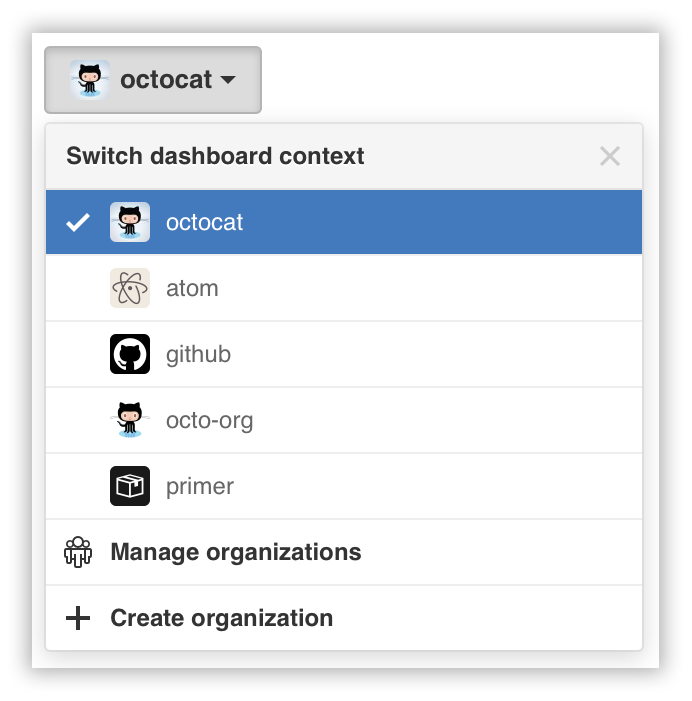
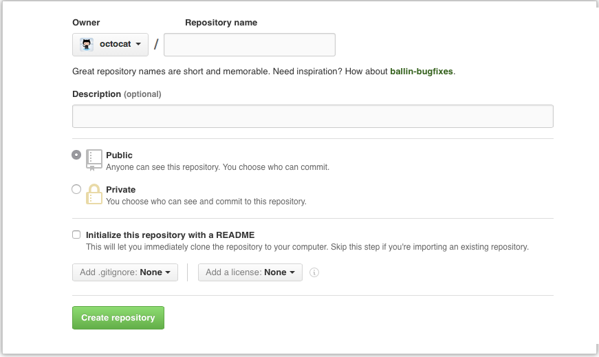

# Creando un nuevo repositorio

Podés crear un nuevo repositorio en tu cuenta personal o en cualquiera de las organizaciones en las que tengas los permisos suficientes.

## 1
En tu barra de usuario, en el margen superior derecho de cualquier página, clickeá [el botón "Create a New Repo" ("Crear un nuevo repo")](https://github.com/new)

## 2
Seleccioná la cuenta en la que querés crear el repositorio

## 3
Ingresá un nombre, elegí si hacerlo público o privado, y clickeá "Create repository" ("Crear repositorio")

 > **Tip:** Si no tenés permisos de Owner ("dueño") o Admin ("administrador") en la organización, se te notificará "insufficient permission" ("permiso insuficiente") en la lista.
